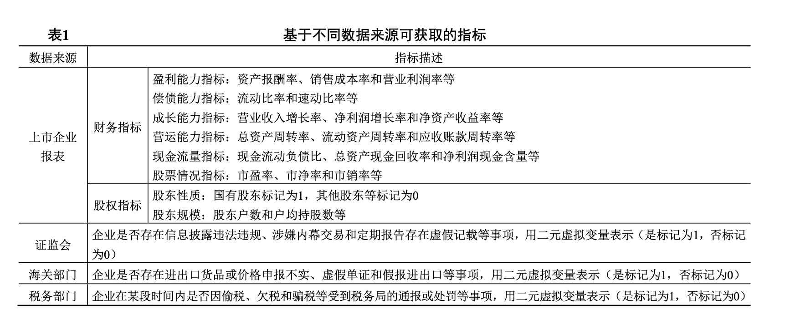

# 税收行为分类

数据来源：锐思金融研究数据库 [http://db.resset.com]
y: 公司重大事项 — 重大事项违规处罚 - 2015.01.01至2024.12.31，涉及内容799其他，报表类型Q4年报
X: 财务指标 - 财务指标 - 财务比率，2015.01.01至2024.12.31，报表类型Q4年报

变量选择：

原因：
财务指标：企业常常会采取隐藏收入、虚增成本费用、虚构原始凭证等手段以减少税源或推迟纳税，能够揭示该类行为的指标有销售收入成本率、销售毛利率、流动比率和资产周转率等
股权指标：不同股权性质和结构对上市企业税收筹划的非税成本具有不同影响，可能导致控股股东以及高层管理者产生不同的税收行为

